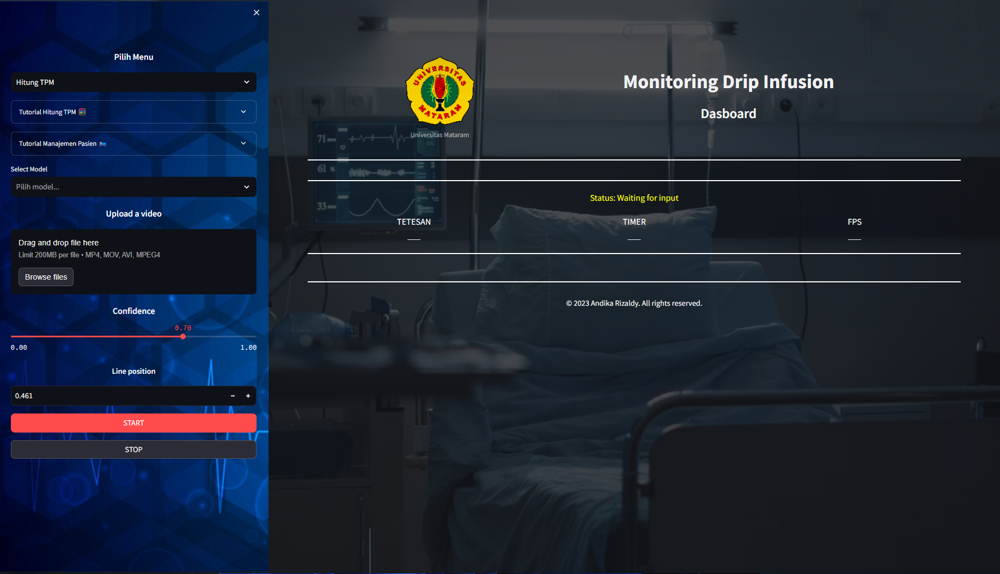

# Monitoring Drip Infusion using YOLOv5 and Deep SORT



## Introduction

This project is used to counting infusion drop.
I run this project on Python 3.9.7

#

- [YOLOv5](https://github.com/ultralytics/yolov5/releases) to detect objects on each of the video frames.

- [Deep SORT](https://github.com/nwojke/deep_sort) to track those objects over different frames and help counting.

- [Streamlit](https://github.com/streamlit/streamlit) to build a simple web.

## Installation

- Install essential libraries and packages:

```python
pip install -r requirements.txt
```

- Run demo:

```python
streamlit run app.py
```

**NOTE**: If the web keeps showing "Please wait...", try to install streamlit version 1.11.0

```python
pip install streamlit
```

# DEMO

## Steps:

1. Click `Browse files` to input video

2. Setting _Custom classes_, _Confidence_ and _Line position_


- Custom classes: choose classes you want to detect

- Confidence: the probability that one object belongs to one class

- Line position: the position of green line, any vehicle have coordinate below the line will be counted

3. Click `START`

## Result


